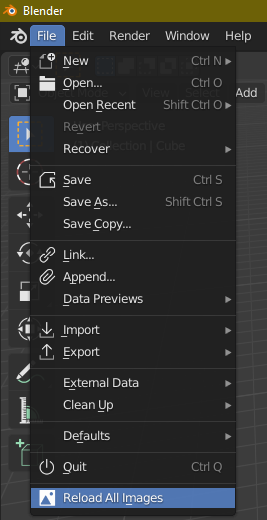
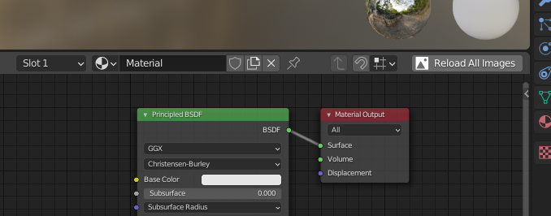
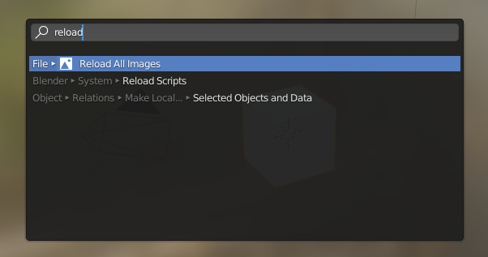
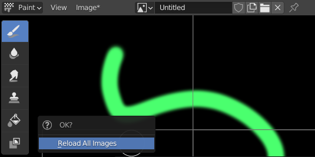
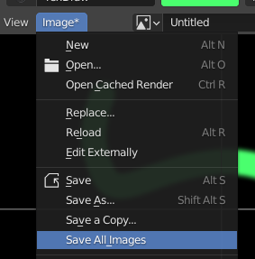

# Reload All Images
A simple addon for [Blender](https://www.blender.org/) that adds a button to reload all images in the Blend file.

This is useful if you edit several texture files externally using an image editor, such as *Krita*, *Affinity Photo* or *Affinity Designer*, or *Adobe Photoshop*, for example and want to quickly reload them all to see the changes on your models when you return to Blender.

## Installing
1. Go to the [releases page](https://github.com/Nidonocu/ReloadAllImages/releases) and download the latest release ZIP file.
It is a good idea to save it to a specific folder where you like to keep your Blender Addons rather than your default Downloads folder.
2. **Don't extract the ZIP**, instead: **open Blender** and click anywhere outside the *Splash screen* to close it.
3. Click the **Edit** menu in the top bar, and then **Preferences**.
4. In the *Preferences* window, click **Addons** from the panel on the left to display the Addons page.
5. In the *Addons* page, click the **Install** button in the top right.
6. Using the file dialog, navigate to where you saved the ZIP file, choose it and then click the **Install Addon** button in the bottom right.
7. Blender will install the addon, but you will need to *Enable* it.

## Enabling the Addon
1. In the *Addons* page of preferences, find the **Reload All Images** Addon. You can search the list by typing '`reload`' in the **Search box** in the top right of the page.
2. To enable the addon, just click the **Checkbox** next to its name.
3. To ensure Blender loads the addon by default for all future sessions, click the **Menu** button in the bottom left of the preferences window.
4. Click **Save Preferences** to save your current options for future projects and sessions.

## Using the Addon
You can find the controls to load all images in the following locations:

### The bottom of the File Menu

### The top right of any node editor

### Pressing **F3** and typing '`reload`' in to the **Menu Search** tool

### Unsaved Changes
If any of your Blend file's images have been edited inside Blender and not yet saved, you will see this confirmation menu:

If you go ahead and click **Reload All Images**, all images will be reloaded and any changes will be reverted to the version saved to disk.
> If you do this accidentally, you can still **Undo** and return to the previous version before reloading as long as you don't close Blender.

If you want to save all images changed in Blender before reloading, click anywhere else to cancel the reload, then use the built-in **Save All Images** command:

